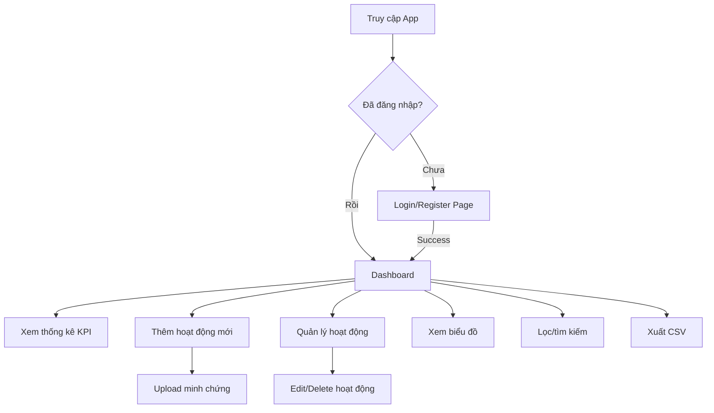

# Tài liệu Kỹ thuật - Ứng dụng Theo dõi Hoạt động Ngoại khóa

## 1. Tổng quan Dự án

### 1.1 Mô tả

Ứng dụng web cá nhân giúp sinh viên ghi chú và thống kê các hoạt động ngoại khóa đã tham gia để theo dõi tiến độ học tập của bản thân. Ứng dụng tích hợp hệ thống đăng nhập, chức năng thêm hoạt động kèm thông tin chi tiết và tải lên ảnh minh chứng, cùng với dashboard trực quan hiển thị dữ liệu được tính toán tự động.

### 1.2 Mục tiêu

- Cung cấp công cụ cá nhân cho sinh viên theo dõi hoạt động ngoại khóa
- Tự động tính toán thống kê và tiến độ đạt mục tiêu
- Interface thân thiện với người Việt Nam
- Bảo mật dữ liệu cá nhân với Firebase Authentication
- Trải nghiệm responsive trên mọi thiết bị

## 2. Kiến trúc Hệ thống

### 2.1 Stack Công nghệ

#### Frontend

- **React 19.1.1**: UI library với JSX syntax
- **Vite 7.1.2**: Build tool và development server
- **JavaScript (ES6+)**: Không sử dụng TypeScript
- **React Router DOM 7.8.2**: Client-side routing
- **Tailwind CSS 4.1.12**: Utility-first CSS framework

#### Backend & Services

- **Firebase Authentication**: Quản lý đăng nhập/đăng ký
- **Firebase Firestore**: NoSQL database real-time
- **Firebase Storage**: Lưu trữ file minh chứng
- **Firebase Hosting**: Deployment platform (optional)

#### Data Visualization

- **Chart.js 4.5.0**: Charting library
- **react-chartjs-2 5.3.0**: React wrapper cho Chart.js

#### Development Tools

- **ESLint 9.33.0**: Code linting và style enforcement
- **PostCSS + Autoprefixer**: CSS processing
- **Vite Dev Server**: Hot reload development

### 2.2 Cấu trúc Project

```
src/
├── components/           # React components tái sử dụng
│   ├── ActivityEditModal.jsx    # Modal chỉnh sửa hoạt động
│   ├── ActivityForm.jsx         # Form thêm hoạt động mới
│   ├── ActivityList.jsx         # Danh sách hoạt động
│   ├── Charts.jsx              # Biểu đồ (Donut, Bar)
│   ├── ExportButton.jsx        # Nút xuất CSV
│   ├── FileUpload.jsx          # Upload file minh chứng
│   ├── Footer.jsx              # Footer layout
│   ├── Header.jsx              # Header navigation
│   ├── ScoreTargetCard.jsx     # Card mục tiêu điểm
│   ├── SearchFilter.jsx        # Bộ lọc và tìm kiếm
│   └── StatsCard.jsx           # Thẻ hiển thị thống kê
├── contexts/             # React contexts
│   └── AuthContext.jsx          # Context quản lý authentication
├── layouts/              # Layout components
│   ├── AppLayout.jsx           # Layout với header/footer
│   └── PublicLayout.jsx        # Layout public pages
├── lib/                  # External libraries config
│   └── firebase.js             # Firebase configuration
├── pages/                # Route pages
│   ├── Dashboard.jsx           # Trang chính dashboard
│   ├── LoginPage.jsx           # Trang đăng nhập
│   └── RegisterPage.jsx        # Trang đăng ký
├── services/             # Business logic services
│   ├── activitiesService.js    # Firestore CRUD cho activities
│   └── userService.js          # Quản lý user profiles
├── utils/                # Utility functions
│   └── csvExport.js            # Export CSV functionality
├── App.jsx               # Main app router
├── index.css             # Global styles với Tailwind
└── main.jsx              # App entry point
```

### 2.3 Flow Ứng dụng



## 3. Chi tiết Components & User Interface

### 3.1 Authentication Flow

#### AuthContext.jsx

- **Mục đích**: Global state management cho authentication
- **State**: `user`, `loading`
- **Methods**: `login()`, `register()`, `logout()`
- **Firebase Integration**:
  - `onAuthStateChanged` listener
  - `signInWithEmailAndPassword`
  - `createUserWithEmailAndPassword`
  - `signOut`

**Props & State Management**:

```javascript
// State structure
const [user, setUser] = useState(null);
const [loading, setLoading] = useState(true);

// Context value object
const value = { user, loading, login, register, logout };

// Provider usage
<AuthContext.Provider value={value}>{children}</AuthContext.Provider>;
```

**Hook Usage**:

```javascript
// In any component
const { user, loading, login, logout } = useAuth();

// Protected route logic
if (loading) return <div>Loading...</div>;
if (!user) return <Navigate to="/login" replace />;
```

#### LoginPage.jsx & RegisterPage.jsx

**UI Structure**:

- Centered form layout với background xám nhạt
- Form validation với error messaging
- Loading states during authentication
- Navigation links giữa login/register

**Props**: None (standalone pages)
**State Management**:

```javascript
const [email, setEmail] = useState("");
const [password, setPassword] = useState("");
const [error, setError] = useState("");
const [loading, setLoading] = useState(false);
```

**User Interactions**:

1. User nhập email/password
2. Submit form → gọi `login()` hoặc `register()`
3. Success → navigate to `/dashboard`
4. Error → hiển thị error message
5. Link navigation giữa login ↔ register

### 3.2 Dashboard Core

#### Dashboard.jsx

**Role**: Main application interface và orchestration hub

**Props**: None (route component)

**State Management**:

```javascript
const [items, setItems] = useState([]); // Danh sách activities
const [editingActivity, setEditingActivity] = useState(null); // Activity đang edit
const [userProfile, setUserProfile] = useState(null); // User profile
const [filters, setFilters] = useState({}); // Current filter state
```

**Computed Values**:

```javascript
// Apply filters to activities
const filteredItems = applyFilters(items, filters);

// Calculate statistics
const stats = {
  totalActivities: items.length,
  totalHours: items.reduce((sum, item) => sum + (item.hours || 0), 0),
  totalScore: items.reduce((sum, item) => sum + (item.score || 0), 0),
  activitiesThisMonth: items.filter((item) => {
    // Logic lọc hoạt động tháng hiện tại
  }).length,
};
```

**Layout Structure**:

- **Header**: Sticky navigation với user info và logout
- **Stats Grid**: 4-column responsive KPI cards
- **Main Content Grid**:
  - Left column (1/4): ActivityForm + ScoreTargetCard
  - Right column (3/4): Charts + SearchFilter + ActivityList
- **Modal Overlay**: ActivityEditModal khi cần thiết

**Event Handlers**:

```javascript
async function handleCreate(data) {
  await addActivity(user.uid, data);
}

async function handleDelete(id) {
  if (confirm("Xoá hoạt động này?")) {
    await removeActivity(id);
  }
}

function handleEdit(activity) {
  setEditingActivity(activity);
}

async function handleSaveEdit(id, data) {
  await updateActivity(id, data);
  setEditingActivity(null);
}
```

**Data Flow**:

1. Component mount → subscribe to activities + load user profile
2. Real-time updates → `setItems()` được gọi từ Firestore subscription
3. User actions → gọi service functions → Firestore cập nhật → UI re-render
4. Filter changes → re-compute filteredItems → ActivityList re-render

### 3.3 Activity Management Components

#### ActivityForm.jsx

**Purpose**: Form component để thêm hoạt động ngoại khóa mới

**Props**:

```javascript
{
  onCreate: function  // Callback khi submit thành công
}
```

**Internal State**:

```javascript
const [title, setTitle] = useState("");
const [date, setDate] = useState("");
const [category, setCategory] = useState("volunteer");
const [organizer, setOrganizer] = useState("");
const [location, setLocation] = useState("");
const [hours, setHours] = useState(0);
const [score, setScore] = useState(0);
const [note, setNote] = useState("");
const [attachments, setAttachments] = useState([]);
const [saving, setSaving] = useState(false);
```

**Form Fields**:

- `title*` (text): Tên hoạt động - Required
- `date*` (date): Ngày tham gia - Required
- `category*` (select): Danh mục - Required
- `organizer` (text): Ban tổ chức - Optional
- `location` (text): Địa điểm - Optional
- `hours` (number): Số giờ tham gia - Optional (step 0.5)
- `score` (number): Điểm đạt được - Optional
- `note` (textarea): Ghi chú - Optional
- `attachments` (FileUpload): Minh chứng - Optional

**Category Options**:

```javascript
const categories = [
  { value: "volunteer", label: "Tình nguyện" },
  { value: "club", label: "CLB/Đội nhóm" },
  { value: "competition", label: "Cuộc thi" },
  { value: "seminar", label: "Hội thảo" },
  { value: "cultural", label: "Văn hóa - Nghệ thuật" },
  { value: "sports", label: "Thể thao" },
  { value: "academic", label: "Học thuật" },
  { value: "other", label: "Khác" },
];
```

**User Flow**:

1. User điền thông tin form → validation real-time
2. Upload files → FileUpload component xử lý
3. Submit → `onCreate(formData)` → clear form
4. Loading state → disable form during submission

#### ActivityList.jsx

**Purpose**: Hiển thị danh sách hoạt động với actions

**Props**:

```javascript
{
  items: array,           // Danh sách activities đã được filter
  onEdit: function,       // Callback edit activity
  onDelete: function      // Callback delete activity
}
```

**Features**:

- **Empty State**: Icon + message khuyến khích thêm hoạt động đầu tiên
- **Card Layout**: Responsive cards với hover effects
- **Category Badges**: Color-coded theo danh mục
- **Info Display**: Grid layout cho date, organizer, location, hours
- **Score Display**: Star icon với điểm số
- **Attachment Indicator**: Paperclip icon + count
- **Actions**: Edit và Delete buttons

**Category Color Mapping**:

```javascript
const getCategoryColor = (category) => {
  const colors = {
    volunteer: "bg-green-100 text-green-800",
    club: "bg-blue-100 text-blue-800",
    competition: "bg-purple-100 text-purple-800",
    seminar: "bg-yellow-100 text-yellow-800",
    cultural: "bg-pink-100 text-pink-800",
    sports: "bg-orange-100 text-orange-800",
    academic: "bg-indigo-100 text-indigo-800",
    other: "bg-gray-100 text-gray-800",
  };
  return colors[category] || colors.other;
};
```

#### ActivityEditModal.jsx

**Purpose**: Modal overlay để chỉnh sửa hoạt động existing

**Props**:

```javascript
{
  activity: object,       // Activity object cần edit
  onSave: function,       // Callback save changes (id, formData)
  onClose: function       // Callback close modal
}
```

**State Management**:

- Pre-populate form với activity data khi component mount
- Separate state cho form data vs original activity
- File management: hiển thị existing files + upload new files
- Save state để prevent double submission

**File Management Features**:

- **Existing Files Display**: Thumbnail preview + view/delete actions
- **New Upload**: Integrated FileUpload component
- **File Actions**: View (open in new tab), Delete (remove from list)

**Modal Behavior**:

- **Backdrop Click**: Close modal (với confirmation nếu có changes)
- **ESC Key**: Close modal
- **Form Submit**: Validate → save → close
- **Cancel Button**: Discard changes → close

### 3.4 File Management

#### FileUpload.jsx

**Purpose**: Component xử lý upload files minh chứng

**Props**:

```javascript
{
  onUpload: function,      // Callback khi upload thành công (uploadedFiles)
  existingFiles: array     // Danh sách files đã có (optional)
}
```

**Internal State**:

```javascript
const [files, setFiles] = useState([]); // Files được chọn chưa upload
const [uploading, setUploading] = useState(false); // Upload progress state
const [dragOver, setDragOver] = useState(false); // Drag and drop state
```

**Validation Rules**:

```javascript
const allowedTypes = [
  "image/jpeg",
  "image/jpg",
  "image/png",
  "application/pdf",
];
const maxSize = 5 * 1024 * 1024; // 5MB

const validateFile = (file) => {
  if (!allowedTypes.includes(file.type)) {
    return "Chỉ chấp nhận file JPG, PNG hoặc PDF";
  }
  if (file.size > maxSize) {
    return "File không được vượt quá 5MB";
  }
  return null;
};
```

**Upload Process**:

1. **File Selection**: Input click hoặc drag & drop
2. **Validation**: Check type và size cho mỗi file
3. **Preview Generation**: `URL.createObjectURL()` cho images
4. **Upload to Firebase**: Batch upload với unique filenames
5. **Result Callback**: `onUpload(uploadedFiles)` với download URLs

**UI Features**:

- **Drop Zone**: Visual feedback cho drag & drop
- **File List**: Preview với thumbnails và file info
- **Error Display**: File-specific error messages
- **Progress Indicator**: Upload button với loading state
- **Existing Files**: Read-only display cho files đã upload

**Firebase Storage Integration**:

```javascript
const uploadFiles = async () => {
  const uploadPromises = validFiles.map(async (fileObj) => {
    const storageRef = ref(
      storage,
      `activities/${Date.now()}_${fileObj.file.name}`
    );
    const snapshot = await uploadBytes(storageRef, fileObj.file);
    const url = await getDownloadURL(snapshot.ref);

    return {
      name: fileObj.file.name,
      type: fileObj.file.type,
      size: fileObj.file.size,
      url: url,
      uploadedAt: new Date().toISOString(),
    };
  });

  const uploadedFiles = await Promise.all(uploadPromises);
  onUpload(uploadedFiles);
};
```

### 3.5 Data Visualization Components

#### Charts.jsx

**Exports**: `CategoryChart`, `MonthlyChart`

**CategoryChart Component**:

```javascript
// Props
{
  activities: array; // Danh sách activities để analyze
}
```

**Features**:

- **Data Processing**: Group activities by category, sum scores
- **Chart Type**: Doughnut chart (Chart.js)
- **Colors**: Predefined color palette cho consistent branding
- **Labels**: Vietnamese category names
- **Tooltips**: Show score + percentage
- **Empty State**: Icon + message khi chưa có data

**Data Transformation**:

```javascript
const categoryData = activities.reduce((acc, activity) => {
  const cat = activity.category || "other";
  acc[cat] = (acc[cat] || 0) + (activity.score || 0);
  return acc;
}, {});
```

**MonthlyChart Component**:

```javascript
// Props
{
  activities: array; // Danh sách activities để analyze
}
```

**Features**:

- **Chart Type**: Bar chart với dual y-axis
- **Time Range**: 6 tháng gần nhất
- **Metrics**: Số hoạt động + Tổng điểm per month
- **Data Processing**: Group by YYYY-MM format
- **Responsive**: Maintains aspect ratio across devices

**Chart Configuration**:

```javascript
const options = {
  responsive: true,
  maintainAspectRatio: false,
  scales: {
    y: { position: "left", title: { text: "Số hoạt động" } },
    y1: { position: "right", title: { text: "Điểm" } },
  },
};
```

#### StatsCard.jsx

**Purpose**: Reusable KPI display component

**Props**:

```javascript
{
  title: string,        // Card title
  value: string|number, // Main metric value
  subtitle: string,     // Additional info (optional)
  icon: JSX.Element,    // Icon component (optional)
  color: string         // Color variant (blue|green|purple|orange|red)
}
```

**Color Variants**:

```javascript
const colorClasses = {
  blue: "bg-blue-500 text-blue-600 bg-blue-50",
  green: "bg-green-500 text-green-600 bg-green-50",
  purple: "bg-purple-500 text-purple-600 bg-purple-50",
  orange: "bg-orange-500 text-orange-600 bg-orange-50",
  red: "bg-red-500 text-red-600 bg-red-50",
};
```

**Usage Examples**:

- Total Activities: icon=clipboard, color=blue
- Total Hours: icon=clock, color=green
- Total Score: icon=star, color=purple
- Monthly Count: icon=calendar, color=orange

#### ScoreTargetCard.jsx

**Purpose**: Interactive progress tracking component

**Props**:

```javascript
{
  currentScore: number,    // Điểm hiện tại
  target: number,         // Mục tiêu điểm
  onUpdateTarget: function // Callback update target
}
```

**Internal State**:

```javascript
const [isEditing, setIsEditing] = useState(false);
const [newTarget, setNewTarget] = useState(target || 100);
const [saving, setSaving] = useState(false);
```

**Progress Calculation**:

```javascript
const percentage =
  target > 0 ? Math.min((currentScore / target) * 100, 100) : 0;

const getProgressColor = () => {
  if (percentage >= 100) return "bg-green-500";
  if (percentage >= 75) return "bg-blue-500";
  if (percentage >= 50) return "bg-yellow-500";
  return "bg-red-500";
};
```

**UI States**:

- **View Mode**: Progress bar + percentage + status badge
- **Edit Mode**: Input field + save/cancel buttons
- **Status Badges**:
  - 100%+: "✅ Hoàn thành"
  - 75-99%: "🚀 Gần hoàn thành"
  - 50-74%: "⚡ Đang tiến bộ"
  - <50%: "💪 Bắt đầu nào!"

**User Interactions**:

1. Click "Chỉnh sửa" → enter edit mode
2. Change target value → validation
3. Save → call `onUpdateTarget(newValue)` → exit edit mode
4. Cancel → revert changes → exit edit mode

### 3.6 Search & Filter Components

#### SearchFilter.jsx

**Purpose**: Advanced filtering và search functionality

**Props**:

```javascript
{
  onFilterChange: function  // Callback khi filters change (newFilters)
}
```

**Filter State Structure**:

```javascript
const [filters, setFilters] = useState({
  search: "", // Full-text search term
  category: "", // Category filter
  dateFrom: "", // Start date (YYYY-MM-DD)
  dateTo: "", // End date (YYYY-MM-DD)
  scoreMin: "", // Minimum score
  scoreMax: "", // Maximum score
  hoursMin: "", // Minimum hours
  hoursMax: "", // Maximum hours
});
```

**UI Layout**:

- **Header**: Title + active filter badge + expand/collapse toggle
- **Search Bar**: Always visible, placeholder text in Vietnamese
- **Advanced Filters** (Collapsible):
  - Row 1: Category dropdown, Date from, Date to
  - Row 2: Score range (min-max), Hours range (min-max)
- **Clear Filters**: Button để reset tất cả filters

**Search Implementation**:

```javascript
// Full-text search across multiple fields
const searchableText = [
  activity.title,
  activity.organizer,
  activity.location,
  activity.note,
]
  .filter(Boolean)
  .join(" ")
  .toLowerCase();

if (!searchableText.includes(searchTerm)) {
  return false; // Filter out this activity
}
```

**Filter Logic** (applyFilters utility function):

```javascript
export function applyFilters(activities, filters) {
  return activities.filter((activity) => {
    // Search filter
    if (filters.search) {
      /* full-text search logic */
    }

    // Category filter
    if (filters.category && activity.category !== filters.category) {
      return false;
    }

    // Date range filters
    if (filters.dateFrom && activity.date < filters.dateFrom) {
      return false;
    }

    // Numeric range filters (score, hours)
    // ... similar logic for min/max ranges

    return true; // Pass all filters
  });
}
```

**User Experience**:

- Real-time filtering → immediate results
- Filter state persistence trong session
- Active filter indicator
- One-click clear all filters
- Responsive design cho mobile

### 3.7 Data Export Components

#### ExportButton.jsx

**Purpose**: UI button component cho CSV export functionality

**Props**:

```javascript
{
  data: array,           // Activities data để export
  disabled: boolean,     // Optional - disable button
  className: string      // Optional - additional CSS classes
}
```

**Button Features**:

- **Icon**: Download icon từ Heroicons
- **Text**: "Xuất CSV (count)" với số lượng records
- **States**:
  - Normal: Green background
  - Disabled: Grayed out khi no data hoặc disabled prop
  - Hover: Darker green với cursor pointer
- **Click Handler**: Calls `exportToCSV(data)` từ utils

#### csvExport.js Utility

**Export Function**: `exportToCSV(data, filename)`

**Parameters**:

```javascript
{
  data: array,           // Required - Activities để export
  filename: string       // Optional - Custom filename (default: "hoat-dong-ngoai-khoa")
}
```

**CSV Structure**:

```javascript
const headers = [
  "STT", // Sequential number
  "Tên hoạt động", // Activity title
  "Ngày tham gia", // Participation date
  "Danh mục", // Category (translated to Vietnamese)
  "Ban tổ chức", // Organizer
  "Địa điểm", // Location
  "Số giờ", // Hours
  "Điểm", // Score
  "Ghi chú", // Notes
  "Số file đính kèm", // Attachment count
];
```

**Category Translation**:

```javascript
const categoryNames = {
  volunteer: "Tình nguyện",
  club: "CLB/Đội nhóm",
  competition: "Cuộc thi",
  seminar: "Hội thảo",
  cultural: "Văn hóa - Nghệ thuật",
  sports: "Thể thao",
  academic: "Học thuật",
  other: "Khác",
};
```

**Excel Compatibility**:

- **UTF-8 BOM**: `\uFEFF` prefix để Excel hiển thị đúng Vietnamese characters
- **CSV Escaping**: Double quotes trong text được escape thành `""`
- **Filename**: Auto-append current date `YYYY-MM-DD`

**Export Process**:

1. Validate data exists → show alert nếu empty
2. Transform data → apply category translations + formatting
3. Generate CSV content với proper escaping
4. Add UTF-8 BOM cho Excel compatibility
5. Create blob và trigger download
6. Cleanup object URL sau download

## 4. Firebase Integration & API Documentation

### 4.1 Authentication Setup

```javascript
// lib/firebase.js
import { initializeApp } from "firebase/app";
import { getAuth } from "firebase/auth";
import { getFirestore } from "firebase/firestore";
import { getStorage } from "firebase/storage";

const firebaseConfig = {
  apiKey: import.meta.env.VITE_FIREBASE_API_KEY,
  authDomain: import.meta.env.VITE_FIREBASE_AUTH_DOMAIN,
  projectId: import.meta.env.VITE_FIREBASE_PROJECT_ID,
  storageBucket: import.meta.env.VITE_FIREBASE_STORAGE_BUCKET,
  messagingSenderId: import.meta.env.VITE_FIREBASE_MESSAGING_SENDER_ID,
  appId: import.meta.env.VITE_FIREBASE_APP_ID,
};

const app = initializeApp(firebaseConfig);
export const auth = getAuth(app);
export const db = getFirestore(app);
export const storage = getStorage(app);
```

### 4.2 Authentication API

#### AuthContext Methods

```javascript
// contexts/AuthContext.jsx

// Đăng nhập với email/password
login(email, password) => Promise<UserCredential>

// Đăng ký tài khoản mới
register(email, password) => Promise<UserCredential>

// Đăng xuất
logout() => Promise<void>

// State variables
user: User | null           // Current authenticated user
loading: boolean           // Authentication loading state
```

#### Usage Example:

```javascript
import { useAuth } from "../contexts/AuthContext.jsx";

function LoginComponent() {
  const { login, user, loading } = useAuth();

  const handleLogin = async () => {
    try {
      await login("user@example.com", "password");
      // User được tự động cập nhật trong context
    } catch (error) {
      console.error("Login failed:", error.message);
    }
  };
}
```

### 4.2 Firestore Data Model

#### Activities Collection

```javascript
activities/{activityId} = {
  uid: string,           // User ID (privacy isolation)
  title: string,         // Tên hoạt động
  date: string,          // YYYY-MM-DD format
  category: string,      // volunteer, club, competition, etc.
  organizer: string,     // Ban tổ chức
  location: string,      // Địa điểm
  hours: number,         // Số giờ tham gia
  score: number,         // Điểm đạt được
  note: string,          // Ghi chú
  attachments: array,    // File attachments
  createdAt: timestamp,
  updatedAt: timestamp
}
```

#### User Profiles Collection

```javascript
userProfiles/{uid} = {
  displayName: string,
  class: string,
  faculty: string,
  scoreTarget: number,   // Mục tiêu điểm
  createdAt: timestamp,
  updatedAt: timestamp
}
```

### 4.3 Storage Structure

```
storage/activities/{timestamp}_{filename}
```

## 5. Services Layer & API Specifications

### 5.1 activitiesService.js

#### addActivity(uid, data)

**Purpose**: Thêm hoạt động ngoại khóa mới
**Parameters**:

- `uid` (string): User ID từ Firebase Auth
- `data` (object): Activity data object

**Data Structure**:

```javascript
{
  title: string,          // Required - Tên hoạt động
  date: string,           // Required - YYYY-MM-DD format
  category: string,       // Required - Danh mục hoạt động
  organizer: string,      // Optional - Ban tổ chức
  location: string,       // Optional - Địa điểm
  hours: number,          // Optional - Số giờ tham gia (default: 0)
  score: number,          // Optional - Điểm đạt được (default: 0)
  note: string,           // Optional - Ghi chú
  attachments: array      // Optional - Danh sách file đính kèm
}
```

**Example**:

```javascript
await addActivity('user-123', {
  title: 'Tình nguyện mùa hè xanh',
  date: '2025-01-15',
  category: 'volunteer',
  organizer: 'Đoàn trường',
  location: 'Hà Nội',
  hours: 8,
  score: 10,
  note: 'Hoạt động ý nghĩa',
  attachments: [...]
});
```

#### subscribeMyActivities(uid, callback)

**Purpose**: Real-time subscription cho danh sách hoạt động của user
**Parameters**:

- `uid` (string): User ID
- `callback` (function): Function được gọi khi data thay đổi

**Return**: Unsubscribe function để cleanup

**Example**:

```javascript
const unsubscribe = subscribeMyActivities("user-123", (activities) => {
  console.log("Activities updated:", activities);
  setActivities(activities);
});

// Cleanup khi component unmount
return () => unsubscribe();
```

#### updateActivity(id, patch)

**Purpose**: Cập nhật thông tin hoạt động
**Parameters**:

- `id` (string): Activity document ID
- `patch` (object): Fields cần update

**Example**:

```javascript
await updateActivity("activity-456", {
  score: 15,
  note: "Updated note",
  updatedAt: serverTimestamp(),
});
```

#### removeActivity(id)

**Purpose**: Xóa hoạt động
**Parameters**:

- `id` (string): Activity document ID

**Example**:

```javascript
await removeActivity("activity-456");
```

### 5.2 userService.js

#### getUserProfile(uid)

**Purpose**: Lấy profile user, tạo mới nếu chưa có
**Parameters**:

- `uid` (string): User ID

**Return**: User profile object

```javascript
{
  id: string,
  displayName: string,
  class: string,
  faculty: string,
  scoreTarget: number,
  createdAt: timestamp,
  updatedAt: timestamp
}
```

**Example**:

```javascript
const profile = await getUserProfile("user-123");
console.log("Score target:", profile.scoreTarget);
```

#### updateScoreTarget(uid, target)

**Purpose**: Cập nhật mục tiêu điểm của user
**Parameters**:

- `uid` (string): User ID
- `target` (number): Mục tiêu điểm mới

**Example**:

```javascript
await updateScoreTarget("user-123", 120);
```

### 5.3 File Upload API

#### FileUpload Component Integration

**Storage Path**: `activities/{timestamp}_{filename}`
**Validation**:

- File types: JPG, PNG, PDF
- Max size: 5MB
- Auto-generated secure filenames

**Upload Process**:

```javascript
// FileUpload.jsx
const uploadFiles = async () => {
  const uploadPromises = validFiles.map(async (fileObj) => {
    const storageRef = ref(
      storage,
      `activities/${Date.now()}_${fileObj.file.name}`
    );
    const snapshot = await uploadBytes(storageRef, fileObj.file);
    const url = await getDownloadURL(snapshot.ref);

    return {
      name: fileObj.file.name,
      type: fileObj.file.type,
      size: fileObj.file.size,
      url: url,
      uploadedAt: new Date().toISOString(),
    };
  });

  const uploadedFiles = await Promise.all(uploadPromises);
  onUpload(uploadedFiles);
};
```

### 5.4 CSV Export API

#### exportToCSV(data, filename)

**Purpose**: Xuất dữ liệu hoạt động ra file CSV
**Parameters**:

- `data` (array): Danh sách activities để export
- `filename` (string): Tên file (optional, default: "hoat-dong-ngoai-khoa")

**Features**:

- UTF-8 BOM cho Excel compatibility
- Category name translation to Vietnamese
- Auto-generated filename với timestamp
- Proper CSV escaping cho special characters

**Column Headers**:

```javascript
const headers = [
  "STT",
  "Tên hoạt động",
  "Ngày tham gia",
  "Danh mục",
  "Ban tổ chức",
  "Địa điểm",
  "Số giờ",
  "Điểm",
  "Ghi chú",
  "Số file đính kèm",
];
```

### 5.5 Security Implementation

#### Firestore Security Rules

```javascript
// Firestore Rules
rules_version = '2';
service cloud.firestore {
  match /databases/{database}/documents {
    // Activities collection - user can only access own data
    match /activities/{document} {
      allow read, write: if request.auth != null
        && request.auth.uid == resource.data.uid;
      allow create: if request.auth != null
        && request.auth.uid == request.resource.data.uid;
    }

    // User profiles - user can only access own profile
    match /userProfiles/{userId} {
      allow read, write: if request.auth != null
        && request.auth.uid == userId;
    }
  }
}
```

#### Storage Security Rules

```javascript
// Storage Rules
rules_version = '2';
service firebase.storage {
  match /b/{bucket}/o {
    match /activities/{allPaths=**} {
      allow read, write: if request.auth != null;
      // Additional validation cho file size và type
      allow write: if request.resource.size < 5 * 1024 * 1024
        && request.resource.contentType.matches('image/.*|application/pdf');
    }
  }
}
```

## 6. Styling & Responsive Design

### 6.1 Tailwind CSS v4 Configuration

```css
/* index.css */
@import "tailwindcss";

html,
body {
  font-family: Inter, ui-sans-serif, system-ui, -apple-system, Segoe UI, Roboto,
    "Helvetica Neue", Arial, "Noto Sans", "Apple Color Emoji", "Segoe UI Emoji",
    "Segoe UI Symbol";
}
```

### 6.2 Color Scheme

- **Primary**: Blue (#3B82F6, #1D4ED8)
- **Success**: Green (#10B981, #059669)
- **Warning**: Yellow (#F59E0B)
- **Error**: Red (#EF4444)
- **Categories**: Unique colors cho mỗi category type

### 6.3 Responsive Breakpoints

- Mobile: < 768px (single column layout)
- Tablet: 768px - 1024px (2 column grid)
- Desktop: > 1024px (full layout với sidebars)

## 7. Development Workflow

### 7.1 Environment Setup

```bash
# Install dependencies
npm install

# Development server
npm run dev           # Starts on http://localhost:5173

# Build for production
npm run build

# Preview production build
npm run preview

# Linting
npm run lint
```

### 7.2 Environment Variables (.env.local)

```
VITE_FIREBASE_API_KEY=your_api_key
VITE_FIREBASE_AUTH_DOMAIN=your_auth_domain
VITE_FIREBASE_PROJECT_ID=your_project_id
VITE_FIREBASE_STORAGE_BUCKET=your_storage_bucket
VITE_FIREBASE_MESSAGING_SENDER_ID=your_sender_id
VITE_FIREBASE_APP_ID=your_app_id
```

### 7.3 Code Style Guidelines

- **ESLint Configuration**: React hooks rules enabled
- **File Naming**: PascalCase cho components, camelCase cho services
- **Import Style**: Relative imports với file extensions
- **Component Structure**: Functional components với hooks

## 8. Performance Optimizations

### 8.1 Firebase Optimizations

- Real-time subscriptions với cleanup
- Firestore queries với proper indexing
- File upload với size/type validation
- Storage optimization với compression

### 8.2 React Optimizations

- Component memoization where appropriate
- Lazy loading cho large datasets
- Efficient re-renders với proper state management
- Image optimization và lazy loading

### 8.3 Bundle Optimizations

- Vite code splitting
- Tree shaking unused code
- Production build minification
- Modern browser targeting

## 9. Security Considerations

### 9.1 Firebase Security Rules

- User-based data isolation (uid filtering)
- Authenticated access requirements
- File upload restrictions
- Read/write permissions properly configured

### 9.2 Client-side Security

- Input validation và sanitization
- File type và size validation
- XSS protection với proper escaping
- Environment variables protection

## 10. Testing Strategy

### 10.1 Unit Testing

- Component testing với React Testing Library
- Service functions testing
- Utility functions testing
- Mock Firebase services

### 10.2 Integration Testing

- Authentication flow testing
- CRUD operations testing
- File upload testing
- Chart rendering testing

### 10.3 E2E Testing

- User journey testing
- Cross-browser compatibility
- Mobile responsiveness testing
- Performance testing

## 11. Deployment Guide & Setup Instructions

### 11.1 Development Environment Setup

#### Prerequisites

- **Node.js**: Version 18.0.0 hoặc cao hơn
- **npm**: Version 8.0.0 hoặc cao hơn
- **Git**: Version control
- **Modern Browser**: Chrome, Firefox, Edge, Safari
- **Code Editor**: VS Code (recommended) với React extensions

#### Local Development Setup

```bash
# Clone repository
git clone [repository-url]
cd ngoai-khoa-app

# Install dependencies
npm install

# Setup environment variables
cp .env.example .env.local
# Sửa các giá trị Firebase trong .env.local

# Start development server
npm run dev
# Application sẽ chạy tại http://localhost:5173
```

#### Environment Variables (.env.local)

```bash
# Firebase Configuration
VITE_FIREBASE_API_KEY=your_firebase_api_key
VITE_FIREBASE_AUTH_DOMAIN=your_project_id.firebaseapp.com
VITE_FIREBASE_PROJECT_ID=your_project_id
VITE_FIREBASE_STORAGE_BUCKET=your_project_id.appspot.com
VITE_FIREBASE_MESSAGING_SENDER_ID=your_messaging_sender_id
VITE_FIREBASE_APP_ID=your_firebase_app_id
```

### 11.2 Firebase Project Setup

#### Step 1: Tạo Firebase Project

1. Truy cập [Firebase Console](https://console.firebase.google.com/)
2. Click "Add project" → nhập tên project
3. Enable Google Analytics (optional)
4. Tạo project và chờ initialization

#### Step 2: Enable Services

```bash
# Authentication
- Go to Authentication → Sign-in method
- Enable Email/Password authentication
- (Optional) Enable Google Sign-In

# Firestore Database
- Go to Firestore Database → Create database
- Choose production mode → select region (asia-southeast1 for Vietnam)

# Storage
- Go to Storage → Get started
- Choose security rules → select region
```

#### Step 3: Web App Configuration

```bash
# Project Settings → General → Your apps
1. Click "Add app" → Web app icon
2. Register app name: "Ngoai Khoa App"
3. Copy Firebase configuration object
4. Paste values vào .env.local file
```

#### Step 4: Security Rules Setup

**Firestore Rules** (`firestore.rules`):

```javascript
rules_version = '2';
service cloud.firestore {
  match /databases/{database}/documents {
    // Activities - user only access own data
    match /activities/{document} {
      allow read, write: if request.auth != null
        && request.auth.uid == resource.data.uid;
      allow create: if request.auth != null
        && request.auth.uid == request.resource.data.uid;
    }

    // User profiles - user only access own profile
    match /userProfiles/{userId} {
      allow read, write: if request.auth != null
        && request.auth.uid == userId;
    }
  }
}
```

**Storage Rules** (`storage.rules`):

```javascript
rules_version = '2';
service firebase.storage {
  match /b/{bucket}/o {
    match /activities/{allPaths=**} {
      allow read, write: if request.auth != null;
      allow write: if request.auth != null
        && request.resource.size < 5 * 1024 * 1024
        && request.resource.contentType.matches('image/.*|application/pdf');
    }
  }
}
```

### 11.3 Production Deployment

#### Option 1: Firebase Hosting

```bash
# Install Firebase CLI globally
npm install -g firebase-tools

# Login to Firebase
firebase login

# Initialize Firebase trong project directory
firebase init

# Select services: Hosting, Firestore, Storage
# Choose existing project
# Configure hosting:
#   Public directory: dist
#   Single-page app: Yes
#   Overwrite index.html: No

# Build production bundle
npm run build

# Deploy to Firebase Hosting
firebase deploy

# Deploy chỉ hosting (nếu đã setup Firestore/Storage trước đó)
firebase deploy --only hosting
```

#### Option 2: Netlify Deployment

```bash
# Build project
npm run build

# Upload dist/ folder to Netlify
# Hoặc connect GitHub repository cho auto-deploy

# Environment variables trong Netlify dashboard:
# Site settings → Build & deploy → Environment variables
# Thêm tất cả VITE_* variables
```

#### Option 3: Vercel Deployment

```bash
# Install Vercel CLI
npm install -g vercel

# Deploy
vercel

# Add environment variables trong Vercel dashboard
# Settings → Environment Variables
```

### 11.4 Production Checklist

#### Pre-deployment

- [ ] **Environment Variables**: Tất cả VITE\_\* configured properly
- [ ] **Firebase Rules**: Deployed và tested
- [ ] **Build Success**: `npm run build` completes without errors
- [ ] **Bundle Size**: Check build output cho unexpected large files
- [ ] **Dependencies**: Run `npm audit` và fix security issues

#### Security

- [ ] **Firebase Authentication**: Email verification enabled (optional)
- [ ] **Firestore Rules**: Tested với Firebase Rules Playground
- [ ] **Storage Rules**: File upload restrictions applied
- [ ] **HTTPS**: Force HTTPS trong hosting settings
- [ ] **CORS**: Configure nếu cần integrate với external APIs

#### Performance

- [ ] **Image Optimization**: Icons và assets optimized
- [ ] **Bundle Analysis**: Check `npm run build` output sizes
- [ ] **Caching**: Configure caching headers
- [ ] **CDN**: Enable Firebase Hosting CDN
- [ ] **Gzip**: Automatic compression enabled

#### Monitoring

- [ ] **Analytics**: Firebase Analytics setup (optional)
- [ ] **Performance Monitoring**: Firebase Performance setup (optional)
- [ ] **Error Reporting**: Console error monitoring
- [ ] **Usage Tracking**: Monitor Firestore read/write usage

### 11.5 Domain Configuration (Optional)

#### Custom Domain Setup

```bash
# Firebase Hosting custom domain
1. Firebase Console → Hosting → Add custom domain
2. Enter domain name (e.g., ngoai-khoa.example.com)
3. Verify domain ownership
4. Add DNS records tại domain provider:
   - Type: A, Name: @, Value: [Firebase IP]
   - Type: CNAME, Name: www, Value: [Firebase domain]
5. Wait for SSL certificate provisioning (24-48 hours)
```

### 11.6 CI/CD Pipeline (Advanced)

#### GitHub Actions Example

```yaml
# .github/workflows/deploy.yml
name: Deploy to Firebase Hosting

on:
  push:
    branches: [main]

jobs:
  deploy:
    runs-on: ubuntu-latest
    steps:
      - uses: actions/checkout@v3

      - name: Setup Node.js
        uses: actions/setup-node@v3
        with:
          node-version: "18"

      - name: Install dependencies
        run: npm ci

      - name: Build project
        run: npm run build
        env:
          VITE_FIREBASE_API_KEY: ${{ secrets.VITE_FIREBASE_API_KEY }}
          VITE_FIREBASE_AUTH_DOMAIN: ${{ secrets.VITE_FIREBASE_AUTH_DOMAIN }}
          # ... other env variables

      - name: Deploy to Firebase
        uses: FirebaseExtended/action-hosting-deploy@v0
        with:
          repoToken: ${{ secrets.GITHUB_TOKEN }}
          firebaseServiceAccount: ${{ secrets.FIREBASE_SERVICE_ACCOUNT }}
          projectId: your-firebase-project-id
```

## 12. Testing, Debug & Maintenance Guide

### 12.1 Testing Strategy

#### Manual Testing Checklist

**Authentication Flow**:

```bash
✓ User registration with valid email/password
✓ User registration với invalid data (error handling)
✓ User login với correct credentials
✓ User login với incorrect credentials
✓ Logout functionality
✓ Protected routes redirect khi not authenticated
✓ Auto-login persistence across browser sessions
```

**Activity Management**:

```bash
✓ Add activity với required fields only
✓ Add activity với all fields filled
✓ Form validation messages for missing required fields
✓ Edit existing activity
✓ Delete activity với confirmation
✓ Real-time updates khi activity added/edited/deleted
```

**File Upload**:

```bash
✓ Upload valid files (JPG, PNG, PDF < 5MB)
✓ Reject invalid file types với error message
✓ Reject oversized files với error message
✓ Multiple file upload
✓ File preview generation
✓ Drag and drop functionality
```

**Dashboard & Charts**:

```bash
✓ Stats cards hiển thị correct calculations
✓ Category chart với data
✓ Monthly chart với data
✓ Empty state handling khi no activities
✓ Responsive layout trên various screen sizes
```

**Search & Filter**:

```bash
✓ Full-text search functionality
✓ Category filter
✓ Date range filter
✓ Score và hours range filters
✓ Combined multiple filters
✓ Clear filters functionality
✓ Real-time filter results
```

**CSV Export**:

```bash
✓ Export all activities
✓ Export filtered activities
✓ Vietnamese characters trong Excel
✓ Proper filename với timestamp
✓ Handle empty data gracefully
```

#### Automated Testing Setup

**Unit Testing với Vitest**:

```bash
# Install testing dependencies
npm install -D vitest @testing-library/react @testing-library/jest-dom jsdom

# Add to package.json scripts
{
  "scripts": {
    "test": "vitest",
    "test:ui": "vitest --ui",
    "test:coverage": "vitest --coverage"
  }
}

# Create vitest.config.js
import { defineConfig } from 'vitest/config'
import react from '@vitejs/plugin-react'

export default defineConfig({
  plugins: [react()],
  test: {
    environment: 'jsdom',
    setupFiles: ['./src/test/setup.js'],
  },
})
```

**Example Component Tests**:

```javascript
// src/components/__tests__/StatsCard.test.jsx
import { render, screen } from "@testing-library/react";
import StatsCard from "../StatsCard";

describe("StatsCard", () => {
  test("renders title và value correctly", () => {
    render(
      <StatsCard
        title="Total Activities"
        value={42}
        subtitle="activities joined"
        color="blue"
      />
    );

    expect(screen.getByText("Total Activities")).toBeInTheDocument();
    expect(screen.getByText("42")).toBeInTheDocument();
    expect(screen.getByText("activities joined")).toBeInTheDocument();
  });
});
```

### 12.2 Debug Tools & Techniques

#### Development Debugging

**React Developer Tools**:

- Install Chrome/Firefox extension
- Inspect component props và state
- Track component re-renders
- Profile performance issues

**Firebase Debugging**:

```javascript
// Enable Firestore offline persistence
import { enableNetwork, disableNetwork } from "firebase/firestore";

// Debug network connectivity
window.enableFirestore = () => enableNetwork(db);
window.disableFirestore = () => disableNetwork(db);

// Log Firestore operations
import { connectFirestoreEmulator } from "firebase/firestore";
if (location.hostname === "localhost") {
  connectFirestoreEmulator(db, "localhost", 8080);
}
```

**Vite Development Tools**:

```bash
# Enable detailed logging
npm run dev -- --debug

# Build analysis
npm run build -- --mode=development
npm run preview

# Bundle analyzer
npm install -D rollup-plugin-visualizer
# Add to vite.config.js plugins
```

#### Production Debugging

**Browser Console Monitoring**:

```javascript
// Add error boundary để catch React errors
class ErrorBoundary extends React.Component {
  componentDidCatch(error, errorInfo) {
    console.error("React Error:", error, errorInfo);
    // Send to error tracking service
  }
}

// Global error handlers
window.addEventListener("error", (event) => {
  console.error("Global Error:", event.error);
});

window.addEventListener("unhandledrejection", (event) => {
  console.error("Unhandled Promise:", event.reason);
});
```

**Firebase Console Monitoring**:

- Monitor Authentication usage
- Check Firestore read/write operations
- Review Storage bandwidth usage
- Analyze performance metrics

### 12.3 Common Issues & Solutions

#### Build và Development Issues

**Vite Build Failures**:

```bash
# Problem: Build fails with memory errors
# Solution: Increase Node.js memory limit
node --max-old-space-size=4096 node_modules/.bin/vite build

# Problem: Hot reload not working
# Solution: Check firewall settings và port availability
npm run dev -- --host 0.0.0.0 --port 3000
```

**Dependency Conflicts**:

```bash
# Clear node_modules và package-lock.json
rm -rf node_modules package-lock.json
npm install

# Check for duplicate dependencies
npm ls --depth=0
npx npm-check-updates -u
```

#### Firebase Connection Issues

**Authentication Problems**:

```javascript
// Debug auth state changes
import { onAuthStateChanged } from "firebase/auth";

onAuthStateChanged(auth, (user) => {
  console.log("Auth state changed:", user?.uid || "signed out");
});

// Check environment variables
console.log("Firebase Config:", {
  apiKey: import.meta.env.VITE_FIREBASE_API_KEY?.substring(0, 10) + "...",
  authDomain: import.meta.env.VITE_FIREBASE_AUTH_DOMAIN,
  projectId: import.meta.env.VITE_FIREBASE_PROJECT_ID,
});
```

**Firestore Permission Errors**:

```bash
# Test security rules với Firebase Console → Rules Playground
# Common issue: Missing uid field trong document

# Verify document structure
{
  uid: "user-123",           // Required for security rules
  title: "Activity title",
  // ... other fields
}
```

#### Performance Issues

**Large Bundle Size**:

```javascript
// Lazy load components
const Dashboard = lazy(() => import("./pages/Dashboard"));
const Charts = lazy(() => import("./components/Charts"));

// Wrap trong Suspense
<Suspense fallback={<div>Loading...</div>}>
  <Dashboard />
</Suspense>;
```

**Slow Firestore Queries**:

```javascript
// Add composite indexes for complex queries
// Firebase Console → Firestore → Indexes

// Optimize queries với proper ordering
const q = query(
  collection(db, "activities"),
  where("uid", "==", userId),
  orderBy("createdAt", "desc"),
  limit(50) // Limit results
);
```

### 12.4 Maintenance Schedule

#### Weekly Tasks

- [ ] Monitor Firebase usage quotas
- [ ] Check application performance metrics
- [ ] Review user-reported issues
- [ ] Update development dependencies (dev only)

#### Monthly Tasks

- [ ] Update production dependencies
- [ ] Run security audit: `npm audit`
- [ ] Review và update documentation
- [ ] Backup Firestore data (if needed)
- [ ] Performance testing với new data volume

#### Quarterly Tasks

- [ ] Firebase SDK major version updates
- [ ] React và Vite major updates
- [ ] Security rules review và testing
- [ ] User experience improvements based on feedback
- [ ] Feature roadmap review

### 12.5 Monitoring & Analytics

#### Firebase Analytics Setup

```javascript
// lib/analytics.js (optional)
import { getAnalytics, logEvent } from "firebase/analytics";

const analytics = getAnalytics(app);

export const trackEvent = (eventName, parameters = {}) => {
  if (analytics) {
    logEvent(analytics, eventName, parameters);
  }
};

// Usage trong components
trackEvent("activity_created", { category: "volunteer" });
trackEvent("csv_exported", { record_count: activities.length });
```

#### Performance Monitoring

```javascript
// lib/performance.js (optional)
import { getPerformance, trace } from "firebase/performance";

const perf = getPerformance(app);

export const measureOperation = async (name, operation) => {
  const t = trace(perf, name);
  t.start();
  try {
    const result = await operation();
    return result;
  } finally {
    t.stop();
  }
};
```

## 13. Feature Roadmap & Future Enhancements

### 13.1 Completed Features (Version 1.0)

**Core Functionality**:

- ✅ User authentication với Firebase Auth (email/password)
- ✅ CRUD operations cho extracurricular activities
- ✅ File upload system với Firebase Storage (JPG, PNG, PDF)
- ✅ Real-time dashboard với KPI metrics
- ✅ Interactive charts (category donut, monthly trends)
- ✅ Personal score target tracking với progress visualization
- ✅ Advanced search và filtering system
- ✅ CSV export functionality với Vietnamese support
- ✅ Responsive design cho mobile/tablet/desktop
- ✅ Privacy-by-design architecture (uid-based isolation)

### 13.2 Phase 2 Enhancements (Planned)

**Advanced Analytics**:

- 📊 Detailed report generation với PDF export
- 📈 Year-over-year comparison charts
- 🏆 Achievement badges system based on activity completion
- 📅 Calendar integration để track upcoming activities

**User Experience Improvements**:

- 🌙 Dark mode support
- 🔔 Notification system cho upcoming deadlines
- 💾 Offline support với service workers
- 🎯 Activity recommendations based on user patterns

### 13.3 Phase 3 Collaborative Features (Future)

**Team Integration**:

- 👥 Team/club activity sharing (optional)
- 📤 Activity invitation system
- 🏫 University-wide activity discovery
- 👨‍🏫 Supervisor/advisor dashboard views

### 13.4 Phase 4 Mobile & Extended Platform (Long-term)

**Mobile Applications**:

- 📱 React Native mobile app
- 📸 Quick photo capture từ mobile
- 🔄 Cross-platform synchronization
- 📍 Location-based activity logging

**Advanced Features**:

- 🤖 AI-powered activity categorization
- 📊 Machine learning insights về activity patterns
- 🌐 Multi-language support (English, Vietnamese)
- 🔗 Integration với university systems (LMS, student portal)

## 14. API Documentation Summary

### 14.1 Authentication APIs

```javascript
// AuthContext methods
login(email, password) → Promise<UserCredential>
register(email, password) → Promise<UserCredential>
logout() → Promise<void>
```

### 14.2 Activity Management APIs

```javascript
// activitiesService methods
addActivity(uid, data) → Promise<void>
subscribeMyActivities(uid, callback) → UnsubscribeFunction
updateActivity(id, patch) → Promise<void>
removeActivity(id) → Promise<void>
```

### 14.3 User Profile APIs

```javascript
// userService methods
getUserProfile(uid) → Promise<UserProfile>
updateScoreTarget(uid, target) → Promise<void>
```

### 14.4 Utility APIs

```javascript
// csvExport utility
exportToCSV(data, filename?) → void

// SearchFilter utility
applyFilters(activities, filters) → Array<Activity>
```

## 15. Data Models Reference

### 15.1 Activity Model

```typescript
interface Activity {
  id: string; // Firestore document ID
  uid: string; // User ID (required for security)
  title: string; // Activity title (required)
  date: string; // Date in YYYY-MM-DD format (required)
  category: CategoryType; // Activity category (required)
  organizer?: string; // Organizing body (optional)
  location?: string; // Location (optional)
  hours?: number; // Hours participated (default: 0)
  score?: number; // Score earned (default: 0)
  note?: string; // Additional notes (optional)
  attachments?: FileAttachment[]; // File attachments (optional)
  createdAt: Timestamp; // Creation timestamp
  updatedAt: Timestamp; // Last update timestamp
}

type CategoryType =
  | "volunteer"
  | "club"
  | "competition"
  | "seminar"
  | "cultural"
  | "sports"
  | "academic"
  | "other";
```

### 15.2 User Profile Model

```typescript
interface UserProfile {
  id: string; // User ID (same as Firebase Auth UID)
  displayName?: string; // Display name (optional)
  class?: string; // Student class (optional)
  faculty?: string; // Faculty/department (optional)
  scoreTarget: number; // Score target (default: 100)
  createdAt: Timestamp; // Profile creation timestamp
  updatedAt: Timestamp; // Last update timestamp
}
```

### 15.3 File Attachment Model

```typescript
interface FileAttachment {
  name: string; // Original filename
  type: string; // MIME type
  size: number; // File size in bytes
  url: string; // Firebase Storage download URL
  uploadedAt: string; // Upload timestamp (ISO string)
}
```

## 16. Security & Privacy

### 16.1 Data Privacy Principles

- **User Isolation**: Tất cả data được filter by `uid`, không có cross-user access
- **No Admin Access**: Không có admin role có thể xem data của users khác
- **Local Processing**: Filtering, search, calculations thực hiện client-side
- **Minimal Data Collection**: Chỉ collect data cần thiết cho functionality

### 16.2 Security Implementation

- **Authentication Required**: Tất cả data operations require valid Firebase Auth token
- **Firestore Rules**: Server-side validation ensure uid-based access only
- **Input Validation**: Client-side và server-side validation cho all user inputs
- **File Security**: Upload restrictions (type, size) và secure storage paths

## 17. Performance Specifications

### 17.1 Target Metrics

- **Initial Load**: < 3 seconds trên 3G connection
- **Dashboard Render**: < 1 second với up to 500 activities
- **Chart Generation**: < 500ms với full dataset
- **Search Response**: < 100ms real-time filtering
- **File Upload**: Progress feedback với 5MB max per file

### 17.2 Optimization Techniques

- **Code Splitting**: Lazy loading cho non-critical components
- **Firestore Optimization**: Proper indexing và query limits
- **Image Optimization**: Compressed thumbnails cho file previews
- **Caching Strategy**: Browser caching cho static assets

---

## Phụ lục

### A. Troubleshooting Quick Reference

```bash
# Build issues
rm -rf node_modules package-lock.json && npm install
npm run build -- --mode development

# Firebase connection
Check .env.local variables
Verify Firebase project configuration
Test với Firebase Console

# Styling issues
npm run dev -- --debug
Check Tailwind CSS compilation
Verify import paths

# Performance issues
Use React DevTools Profiler
Check bundle size với build analysis
Monitor Firestore usage trong console
```

### B. Useful Commands

```bash
# Development
npm run dev              # Start development server
npm run build           # Build for production
npm run preview         # Preview production build
npm run lint            # Run ESLint

# Firebase
firebase login          # Authenticate với Firebase
firebase deploy         # Deploy to hosting
firebase emulators:start # Start local emulators

# Testing
npm test                # Run unit tests
npm run test:coverage   # Test với coverage report
```

### C. External Resources

- [React Documentation](https://react.dev/)
- [Vite Guide](https://vitejs.dev/guide/)
- [Firebase Documentation](https://firebase.google.com/docs)
- [Tailwind CSS Documentation](https://tailwindcss.com/docs)
- [Chart.js Documentation](https://www.chartjs.org/docs/)

---

**Tài liệu được tạo**: 27 tháng 1, 2025  
**Phiên bản**: 1.0  
**Tác giả**: Development Team  
**Cập nhật gần nhất**: Hoàn thành tất cả core features và comprehensive documentation

**Lưu ý**: Tài liệu này bao gồm toàn bộ thông tin kỹ thuật cần thiết để hiểu, phát triển, deploy và maintain ứng dụng Ngoại Khóa App. Để cập nhật hoặc đóng góp, vui lòng tham khảo repository GitHub và guidelines trong mục Development.
